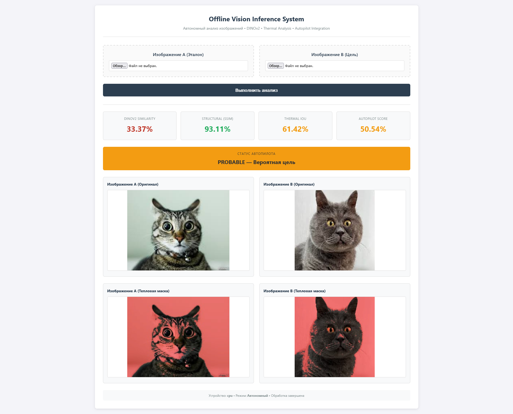

# ThermoDINO

**ThermoDINO** – автономная система визуального анализа, объединяющая **DINOv2** для извлечения признаков с **тепловым анализом изображений**. Оптимизирована для работы на CPU, может использовать GPU при наличии, обеспечивает оффлайн обработку изображений для мониторинга и сравнения.

---

## 🛠 Features

- CPU-оптимизированный модуль извлечения признаков с **DINOv2** (`timm`)
- Тепловой анализ изображений и создание тепловых масок
- Сравнение изображений через:
  - DINO-фичи (cosine similarity)
  - SSIM (структурное сходство)
  - Тепловые подписи (IoU + гистограмма распределения)
- Автономная работа без интернет-соединения
- Веб-интерфейс на **Flask** для загрузки и анализа изображений
- Визуализация тепловых зон и результатов сравнения

---

## ⚙ Installation

1. Клонировать репозиторий:

```bash
git clone https://github.com/VohminV/ThermoDINO.git
cd ThermoDINO
```

2. Создать виртуальное окружение и установить зависимости:

```bash
python3 -m venv venv
source venv/bin/activate
pip install -r requirements.txt
```

> **Примечание:** CPU-оптимизировано, но можно использовать GPU, если доступен.

---

## 📂 Usage

Запуск веб-сервиса:

```bash
python app.py
```

После запуска:
- Откройте браузер: `http://0.0.0.0:5000`
- Загрузите два изображения для анализа
- Получите результаты:
  - **DINO similarity**
  - **SSIM**
  - **Тепловая IoU**
  - **Тепловое распределение**
  - **Автопилотный тепловой скоринг**
  - Визуализация тепловых зон

---

## 🔧 Configuration

- Папки для хранения:
  - `static/uploads` – загруженные изображения
  - `static/results` – результаты обработки
  - `static/thermal` – тепловые визуализации

- Допустимые форматы: `png, jpg, jpeg, bmp, tiff`
- Максимальный размер файла: 16 MB
- Порог теплового анализа: `0.6` (можно изменить в `ThermalAnalyzer`)

---

## 🧠 Model

- **DINOv2 ViT-Small Patch14**
- Используется только **feature extraction**
- Поддержка предобученных весов из `model.pth`
- Вывод: нормализованный CLS-токен `[1, 384]`

---

## 🔍 Similarity Metrics

1. **DINOv2 feature similarity** – cosine similarity между CLS-токенами
2. **SSIM** – структурное сходство изображений
3. **Thermal IoU** – пересечение тепловых масок
4. **Thermal distribution score** – сравнение гистограмм тепловых зон
5. **Autopilot score** – комбинированный тепловой скоринг (70% IoU + 30% распределение)

---

## ⚡ Notes

- Предназначено для **secure/offline environments**
- CPU-оптимизация для Raspberry Pi, Orange Pi, обычных серверов
- Визуализация тепла помогает быстро находить активные зоны на изображении

---

## 📄 License

MIT License – свободное использование и модификация

---

## 👀 Screenshot / Example

> 

---

## 💡 Future Plans

- Поддержка реального времени с камерой
- Расширение метрик анализа (например, multi-scale thermal detection)
- Внедрение автоматической классификации объектов через DINOv2 + дополнительный head

